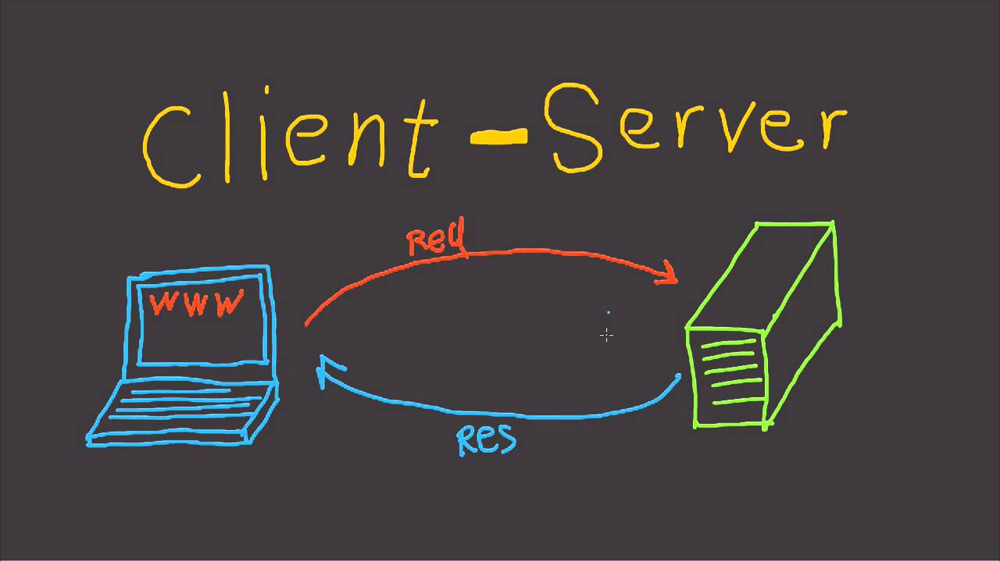

## Minitalk

<br>

The purpose of this project is to code a small data exchange program using UNIX signals.

---

## Mandatory Part <br>

---

• You must create a communication program in the form of a client and server. <br> 
• The server must be launched first, and after being launched it must display its PID. <br>
• The client will take as parameters: <br>
◦ The server PID. <br>
◦ The string that should be sent. <br>
• The client must communicate the string passed as a parameter to the server. <br>
  &ensp; Once the string has been received, the server must display it. <br>
• Communication between your programs should ONLY be done using UNIX signals. <br>
• The server must be able to display the string pretty quickly. By quickly we mean that if you think it is too long, <br>
  &ensp; then it is probably too long (hint: 1 second   for 100 characters is COLOSSAL) <br>
• Your server should be able to receive strings from several clients in a row, without needing to be restarted. <br>
• You can only use the two signals SIGUSR1 and SIGUSR2. <br><br>

---

## Bonus

---

• The server confirms every signal received by sending a signal to the client. <br>
• Support Unicode characters! <br><br>

## Badge

---

<br>

---

## Skills

---

- Rigor
- Unix<br>

---

## My grade

---

<br>

---

### What is a signal?

---

>A signal is a notification to a **process** that an event has occurred. Signals are sometimes described as software interrupts.
>
>One process can send a signal to another process. In this use, signals can be employed as a primitive form of interprocess communication (IPC). 
>
>Each signal is defined as a unique (small) integer, starting sequentially from 1. These integers are defined in <signal.h> with symbolic names of the form SIGxxxx. Since the actual numbers used for each signal vary across implementations, it is these symbolic names that are always used in programs. 
>
>A signal is said to be _generated_ by some event. Once generated, a signal is later _delivered_ to a process, which then takes some action in response to the signal. Between the time it is generated and the time it is delivered, a signal is said to be _pending_.

</details>

### What is a process?

>A process is an instance of an executing **program**.
>
>We can recast the definition of a process given at the start of this section as follows: a process is an abstract entity, defined by the kernel, to which system resources are allocated in order to execute a program.
>
>From the kernel’s point of view, a process consists of user-space memory containing program code and variables used by that code, and a range of kernel data structures that maintain information about the state of the process. The information recorded in the kernel data structures includes various identifier numbers
(IDs) associated with the process, virtual memory tables, the table of open file descriptors, information relating to signal delivery and handling, process resource usages and limits, the current working directory, and a host of other information.

---

### What is a program?

---

>A program is a file containing a range of information that describes how to construct a process at run time. One program may be used to construct many processes, or, put conversely, many processes may be running the same program.
	
</details>

---

_You must create a communication program in the form of a **client** and a **server**._

<details>
	
### What is a client-server application?

>A client-server application is one that is broken into two component processes:
>
>- a client, which asks the server to carry out some service by sending it a request message; and
>- a server, which examines the client’s request, performs appropriate actions, and
then sends a response message back to the client.
>
>Sometimes, the client and server may engage in an extended dialogue of requests
and responses.
>
>Typically, the client application interacts with a user, while the server application provides access to some shared resource. Commonly, there are multiple
instances of client processes communicating with one or a few instances of the
server process.

</details>

---

_The server must be started first. After its launch, it has to print its **PID**._
	
<details>

### What is PID?

>Each process has a process ID (PID), a positive integer that uniquely identifies the process on the system. Process IDs are used and returned by a variety of system calls. For example, the kill() system call allows the caller to send a signal to a process with a specific process ID.
>
>The **getpid()** system call returns the process ID of the calling process. The pid_t data type used for the return value of getpid() is an integer type specified by SUSv3 for the purpose of storing process IDs.

```C
int	main(void)
{
	pid_t	pid;

	pid = getpid();
	ft_putnbr_fd(pid, 1);
	ft_putchar_fd('\n', 1);
	return (0);
}
```

</details>

---
	
_The client takes two parameters:_
- _The server PID._
- _The string to send._

<details>

```C
int	main(int argc, char *argv[])
{
	(void) argv;
	if (argc != 3)
	{
		ft_putendl_fd("Usage: ./client server-PID string-to-send", 1);
		exit(EXIT_FAILURE);
	}
	return (0);
}
```

</details>

---
	
_The client must **send the string passed as a parameter to the server**._
	
_The **communication** between your client and your server has to be done only using UNIX signals._
	
_You can only use these two signals: **SIGUSR1** and **SIGUSR2**._

<details>

### [How to send a string using signals?](https://stackoverflow.com/c/42network/a/1920/11916)
	
**Answered by Marc-Eloi Dailet on 42 Network Stack Overflow.**
	
>As you probably know, ASCII characters are encoded on 8 bits (while other characters can be encoded on up to 32, i.e UTF-32). You will have to use **bitwise operations** on each character to determine what to send.
>
>More precisely, you will have to make 8-bit comparisons **for each character to check the binary position of each bit** and send a SIGUSR1 for each 1, and a SIGUSR2 for each 0. (Or the opposite, it's up to you) :)
>
>While doing this, you will have to use bit-shifting to move what you compare, to avoid sending multiple signals for the same bit.
	
### [What are bitwise operations in C?](https://en.wikipedia.org/wiki/Bitwise_operations_in_C)
	
>Bitwise operations are contrasted by byte-level operations which characterize the bitwise operators' logical counterparts, the AND, OR, NOT operators. Instead of performing on individual bits, byte-level operators perform on strings of eight bits (known as bytes) at a time. The reason for this is that a byte is normally the smallest unit of addressable memory (i.e. data with a unique memory address).
>
>This applies to bitwise operators as well, which means that even though they operate on only one bit at a time they cannot accept anything smaller than a byte as their input.
	
### [How to check the binary position of each bit for each character?](https://en.wikipedia.org/wiki/Bitwise_operations_in_C)
	
>The symbol of right shift operator is >>. For its operation, it requires two operands. It shifts each bit in its left operand to the right. The number following the operator decides the number of places the bits are shifted (i.e. the right operand).
>
>Example:
>
>If the variable ch contains the bit pattern 11100101, then ch >> 1 will produce the result 01110010, and ch >> 2 will produce 00111001.
>
>The bitwise AND operator is a single ampersand: &. It is just a representation of AND which does its work on the bits of the operands rather than the truth value of the operands.
>
>For instance, working with a byte (the char type):
```
     11001000  
   & 10111000 
     -------- 
   = 10001000
```
>The most significant bit of the first number is 1 and that of the second number is also 1 so the most significant bit of the result is 1; in the second most significant bit, the bit of second number is zero, so we have the result as 0.
	
The client program converts each character of the string to binary
	
```C
int	main(int argc, char *argv[])
{
	pid_t	pid;
	char	*str;
	int	bit;

	if (argc != 3)
	{
		ft_putendl_fd("Usage: ./client server-PID string-to-send", 1);
		exit(EXIT_FAILURE);
	}
	pid = ft_atoi(argv[1]);
	(void) pid;
	str = argv[2];
	while (*str)
	{
		bit = 8;
		while (bit)
		{
			bit--;
			if ((*str >> bit) & 1)
				ft_putchar_fd('1', 1);
			else if (*str)
				ft_putchar_fd('0', 1);
		}
		str++;
	}
	return (0);
}
```
	
### How to communicate processes?

>One process can send a signal to another process using the **_kill(pid_t pid, int sig)_** system call, which is the analog of the kill shell command. If pid is greater than 0, the signal is sent to the process with the process ID specified by pid.
	
### What are SIGUSR1 and SIGUSR2?

>SIGUSR1 and SIGUSR2 are available for programmer-defined purposes. The kernel never generates these signals for a process. Processes may use these signals to notify one another of events or to synchronize with each other.

Client sends signal to server using the kill() system call
	
```C
static void	error_exit(char *error)
{
	ft_putendl_fd(error, 1);
	exit(EXIT_FAILURE);
}

int	main(int argc, char *argv[])
{
	pid_t	pid;
	char	*str;
	int	bit;
	int	kill_return;

	if (argc != 3)
		error_exit("Usage: ./client server-PID string-to-send");
	pid = ft_atoi(argv[1]);
	str = argv[2];
	while (*str)
	{
		bit = 8;
		while (bit--)
		{
			if ((*str >> bit) & 1)
				kill_return = kill(pid, SIGUSR1);
			else if (*str)
				kill_return = kill(pid, SIGUSR2);
			if (kill_return == -1)
				error_exit("The kill() system call have failed");
		}
		str++;
	}
	return (0);
}
```

</details>
	
---

_**Once the string has been received**, the server must print it._
	
<details>
	
### How a process responds to a signal?

>Instead of accepting the default for a particular signal, a program can change the action that occurs when the signal is delivered. This is known as setting the **_disposition_** of the signal.
>
>A **_signal handler_** is a function, written by the programmer, that performs appropriate tasks in response to the delivery of a signal. For example, the shell has a handler for the SIGINT signal (generated by the interrupt character, Control-C) that causes it to stop what it is currently doing and return control to the main input loop, so that the user is once more presented with the shell prompt.
>
>Invocation of a signal handler may interrupt the main program flow at any time; the kernel calls the handler on the process’s behalf, and when the handler returns, execution of the program resumes at the point where the handler interrupted it. This sequence is illustrated in Figure 20-1.
	


```C
static void	signal_handler(int sig)
{
	if (sig == SIGUSR1)
		ft_putstr_fd("1", 1);
	if (sig == SIGUSR2)
		ft_putstr_fd("0", 1);
	return ;
}
```

### How to set the disposition of the signal?
	
>The _sigaction()_ system call is an alternative to _signal()_ for setting the disposition of a
signal. Although _sigaction()_ is somewhat more complex to use than _signal()_, in return it provides greater flexibility. In particular, _sigaction()_ allows us to retrieve the disposition of a signal without changing it, and to set various attributes controlling precisely what happens when a signal handler is invoked.
	
```C
#include <signal.h>

int	sigaction(int sig, const struct sigaction *act, struct sigaction *oldact);

// Returns 0 on success, or –1 on error
```

>The sig argument identifies the signal whose disposition we want to retrieve or change. This argument can be any signal except SIGKILL or SIGSTOP.
>
>The act argument is a pointer to a structure specifying a new disposition for the signal. If we are interested only in finding the existing disposition of the signal, then we can specify NULL for this argument. 
>
>The oldact argument is a pointer to a structure of the same type, and is used to return information about the signal’s previous disposition. If we are not interested in this information, then we can specify NULL for this argument.
>
>The structures pointed to by act and oldact are of the following type:
	
```C
struct sigaction
{
	void (*sa_handler)(int); /* Address of handler */
	sigset_t sa_mask; /* Signals blocked during handler invocation */
	int sa_flags; /* Flags controlling handler invocation */
	void (*sa_restorer)(void); /* Not for application use */
};
```

>The sa_handler field corresponds to the handler argument given to signal(). It specifies the address of a signal handler.
>
>The sa_mask field defines a **set of signals** that are to be blocked during invocation of the handler defined by sa_handler. When the signal handler is invoked, any signals in this set that are not currently part of the process signal mask are automatically added to the mask before the handler is called. These signals remain in the process signal mask until the signal handler returns, at which time they are automatically removed. The sa_mask field allows us to specify a set of signals that aren’t permitted to interrupt execution of this handler. In addition, the signal that caused the handler to be invoked is automatically added to the process signal mask. This means that a signal handler won’t recursively interrupt itself if a second instance of the same signal arrives while the handler is executing. **_Because blocked signals are not queued, if any of these signals are repeatedly generated during the execution of the handler, they are (later) delivered only once._**

### How to represent a set of signals?

>Many signal-related system calls need to be able to represent a group of different signals. For example, sigaction() and sigprocmask() allow a program to specify a group of signals that are to be blocked by a process.
>
>Multiple signals are represented using a data structure called a _signal set_, provided by the system data type _sigset_t_.
>
>One of **_sigemptyset()_** or **_sigaddset()_** must be used to initialize a signal set. This is because C doesn’t initialize automatic variables, and the initialization of static variables to 0 can’t portably be relied upon as indicating an empty signal set, since signal sets may be implemented using structures other than bit masks.
	
```C
#include <signal.h>
	
int	sigemptyset(sigset_t *set);
int	sigaddset(sigset_t *set, int sig);

// Both return 0 on success, or –1 on error
```

>For each process, the kernel maintains a _signal mask_ — a set of signals whose delivery to the process is currently blocked. If a signal that is blocked is sent to a process, delivery of that signal is delayed until it is unblocked by being removed from the process signal mask.
>
>A signal may be added to the signal mask in the following ways:
> - When a signal handler is invoked, the signal that caused its invocation can be automatically added to the signal mask. Whether or not this occurs depends on the flags used when the handler is established using sigaction().
>
> - When a signal handler is established with sigaction(), it is possible to specify an additional set of signals that are to be blocked when the handler is invoked.
	
>Setting the SA_SIGINFO flag when establishing a handler with sigaction() allows the handler to obtain additional information about a signal when it is delivered. In order to obtain this information, we must declare the handler as follows:
	
```C
void	handler(int sig, siginfo_t *siginfo, void *ucontext);
```

>The first argument, sig, is the signal number, as for a standard signal handler. The second argument, siginfo, is a structure used to provide the additional information about the signal. We describe this structure below. The last argument, ucontext, is also described below.
>
>Since the above signal handler has a different prototype from a standard signal handler, C typing rules mean that we can’t use the sa_handler field of the sigaction structure to specify the address of the handler. Instead, we must use an alternative field: sa_sigaction. In other words, the definition of the sigaction structure is somewhat more complex than was shown. In full, the structure is defined as follows:
	
```C
struct sigaction 
{
	union 
	{
	 void (*sa_handler)(int);
	 void (*sa_sigaction)(int, siginfo_t *, void *);
	}
	__sigaction_handler;
	sigset_t sa_mask;
	int sa_flags;
	void (*sa_restorer)(void);
};
/* Following defines make the union fields look like simple fields
 in the parent structure */
#define sa_handler __sigaction_handler.sa_handler
#define sa_sigaction __sigaction_handler.sa_sigaction
```
Server uses SA_SIGINFO to establish a signal handler:
	
```C
static void	signal_handler(int sig, siginfo_t *siginfo, void *ucontext)
{
	if (sig == SIGUSR1)
		ft_putstr_fd("1", 1);
	if (sig == SIGUSR2)
		ft_putstr_fd("0", 1);
	(void) siginfo;
	(void) ucontext;
	return ;
}

int	main(void)
{
	pid_t				pid;
	struct sigaction	sa;

	pid = getpid();
	ft_putnbr_fd(pid, 1);
	ft_putchar_fd('\n', 1);
	sigemptyset(&sa.sa_mask);
	sa.sa_sigaction = signal_handler;
	sa.sa_flags = SA_SIGINFO;
	if (sigaction(SIGUSR1, &sa, NULL) == -1)
		ft_error_exit("Bad address or Invalid argument");
	if (sigaction(SIGUSR2, &sa, NULL) == -1)
		ft_error_exit("Bad address or Invalid argument");
	return (0);
}
```
	
</details>
	
---
	
_Your server should be able to receive strings from several clients in a row **without needing to restart**._
	
<details>

### How to suspend execution of a process?
	
>Calling _pause()_ suspends execution of the process until the call is interrupted by a
signal handler (or until an unhandled signal terminates the process).
	
```C
#include <unistd.h>

int	pause(void);

// Always returns –1 with errno set to EINTR
```

Server loop forever, waiting for signals.
	
```C
static void	signal_handler(int sig, siginfo_t *siginfo, void *ucontext)
{
	if (sig == SIGUSR1)
		ft_putstr_fd("1", 1);
	if (sig == SIGUSR2)
		kill(siginfo->si_pid, SIGUSR1);
	(void) ucontext;
	return ;
}

int	main(void)
{
	pid_t				pid;
	struct sigaction	sa;

	pid = getpid();
	ft_putnbr_fd(pid, 1);
	ft_putchar_fd('\n', 1);
	sigemptyset(&sa.sa_mask);
	sa.sa_sigaction = signal_handler;
	sa.sa_flags = SA_SIGINFO;
	if (sigaction(SIGUSR1, &sa, NULL) == -1)
		ft_error_exit("Bad address or Invalid argument");
	if (sigaction(SIGUSR2, &sa, NULL) == -1)
		ft_error_exit("Bad address or Invalid argument");
	while (1)
		pause();
	return (0);
}
```

</details>

---
	
_**The server has to display the string pretty quickly**._
	
_The server acknowledges every message received by **sending back a signal to the
client**._
	
ℹ️  _Linux system does NOT queue signals when you already have pending
signals of this type!_

<details>
	
### How to handle signals quickly since they don't queue when they are pending, without losing sent signals?
	
>**The _sleep()_ function suspends execution of the calling process** for the number of seconds specified in the seconds argument or **until a signal is caught** (thus interrupting the call).
